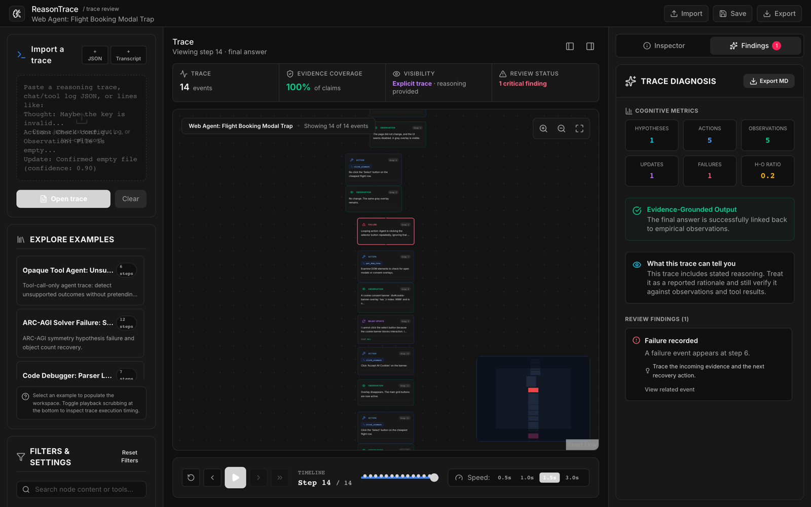

# ReasonTrace

A visual debugger for agent traces. Paste a raw agent log, a chat/tool-call
transcript, or structured event JSON, and ReasonTrace turns it into a graph you
can scrub through step by step, with checks for where the agent looped, acted
without a plan, or reached an answer its evidence doesn't support.



*A bundled sample: a web agent keeps clicking a "Select" button hidden behind a
cookie banner. The failure node is flagged in red; the Findings panel shows
evidence coverage and the recorded failure.*

Once a trace is longer than a few lines, reading it top to bottom stops
working. You want to see where the agent formed a hypothesis, what it did about
it, what it observed, and whether the final answer traces back to any of that.

## Run it

Needs Node 20.19+ (or 22.12+). Everything runs in the browser; there is no backend and no API
key.

```bash
npm install
npm run dev        # http://localhost:5173
```

```bash
npm run build      # static site in dist/
npm run lint
```

Tested on macOS (Apple Silicon) with Node 24.

## What it accepts

- **Plain transcripts** with `Hypothesis:`, `Action:`, `Observation:`,
  `Belief_Update:`, and `Final:` lines:

  ```text
  Hypothesis: The parser bug is an off-by-one error.
  Action: Inspect parser loop boundary.
  Observation: The loop uses <= tokens.length.
  Belief_Update: The hypothesis is strongly supported. [confidence: 0.91]
  Final: Change <= to < in parser.ts.
  ```

- **Chat-message logs** in the familiar `messages` shape, including
  `tool_calls` and `tool` results:

  ```json
  {
    "messages": [
      { "role": "user", "content": "Find order 4812" },
      { "role": "assistant", "tool_calls": [{ "id": "call_1", "function": { "name": "lookup_order", "arguments": "{\"id\":\"4812\"}" } }] },
      { "role": "tool", "tool_call_id": "call_1", "content": "One completed charge found." },
      { "role": "assistant", "content": "There is one completed charge." }
    ]
  }
  ```

- **OpenAI Responses-style** `output` arrays with tool calls.
- **Native event JSON** with explicit IDs and parent links.

Six sample traces ship with the app: an opaque tool agent, an ARC-AGI solver,
a code debugger, a research agent, a web agent, and a planning agent.

## The trace model

Every event has one of seven types: `hypothesis`, `action`, `observation`,
`belief_update`, `decision`, `failure`, `final_answer`. That is enough
structure to draw causal flow without tying the tool to one agent framework.

Each event also carries an `evidenceMode`:

- `explicit`: reasoning the runtime actually emitted
- `observed`: externally visible behavior (messages, tool calls, tool results)
- `inferred`: an analyst's reconstruction from behavior

For an opaque model, ReasonTrace shows what it did, what it saw, and whether
the outcome is supported. It never presents reconstructed behavior as the
model's hidden chain of thought.

## Diagnostics

The checks are rule-based and meant to speed up review, not replace it:

- hypotheses with no supporting observation
- actions with no planning ancestor
- final answers weakly grounded in evidence
- repeated-action loops
- belief updates missing a confidence value
- explicit failure events
- evidence coverage across claims and decisions
- whether the trace is observed behavior, stated rationale, or a mix
- analyst inferences that need extra caution

Each finding links to the event it came from. The current trace exports as
JSON and the diagnosis as Markdown.

## Limitations

- Diagnostics are heuristics, not learned.
- One trace at a time; no side-by-side comparison yet.
- Logs from agent frameworks other than the formats above need an adapter.

## Stack

React 19, TypeScript, Vite, Tailwind CSS, React Flow, Zustand.

## License

MIT
